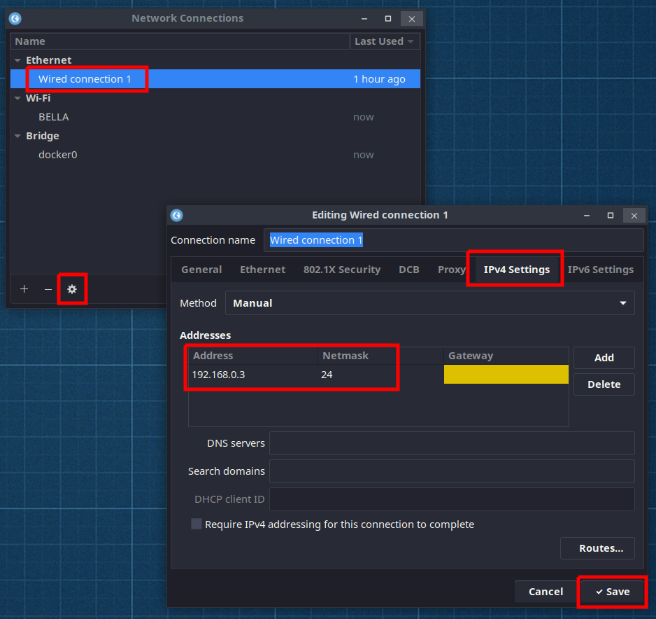

[To README](README.md)

---
<br/>

# 1. How to install Ubuntu on RPI

RPI uses micro SD card as its main disk storage. Ubuntu server 20.10 image file can be downloaded from Canonical and the file can be flashed to a micro SD card by using various ways.

<br/>

## 1.1 Download the OS image file

The OS image file can be found from [https://ubuntu.com/download/raspberry-pi](https://ubuntu.com/download/raspberry-pi). 


<br/>

As mentioned earlier the 64 bit version of Ubuntu server 20.10 will be used so that click the button on the web page or run below command:
```sh
$ cd ~/Downlaods
$ wget https://ubuntu.com/download/raspberry-pi/thank-you?version=20.10&architecture=server-arm64+raspi
```

Since many of EdgeX components are built as ARM64 binary, the 64 bit version should be used for the rest of this tutorial.

<br/>

## 1.2 Flash the image file to micro SD card

Once the image download is done, put the micro SD card into the card reader and the card reader should be inserted to the host PC as well. 

Below commands tell that there is a disk **sdb** just attached as a removable disk:
```sh
$ lsblk
NAME        MAJ:MIN RM   SIZE RO TYPE MOUNTPOINT
loop0         7:0    0   141M  1 loop /snap/slack/30
loop1         7:1    0  97.8M  1 loop /snap/core/10185
sdb           8:16   1  29.8G  0 disk 
nvme0n1     259:0    0 232.9G  0 disk 
├─nvme0n1p1 259:1    0   512M  0 part /boot/efi
└─nvme0n1p2 259:2    0 232.4G  0 part /

$ dmesg | grep Attached
[17709.594036] sd 3:0:0:1: [sdb] Attached SCSI removable disk
```

Balena etcher, Raspberry Pi OS Imager, or Ubuntu Imager can be used but let's try this commands below:
```sh
$ cd ~/Downloads
$ sudo -s

# xzcat extracts the image as raw disk image format and passes to the dd commandlittle by little. Then the dd writes the coming data to the disk.  
$ xzcat ubuntu-20.10-preinstalled-server-arm64+raspi.img.xz | dd of=/dev/sdb bs=8M status=progress; sync
```

Once it is done, the host automatically mounts the disks just flashed. The disks get mounted under **/media/\$USER/system-boot** and **/media/\$USER/writable**. However, please do NOT unmount and move on to the next step. 

<br/>

## 1.3 Network configuration before first boot

The micro SD card is ready but some files need to be edited for network configuration.

RPI 4B has 2 network interfaces - ethernet and WiFi. The official Ubuntu guide for RPI recommends editing a file in the boot partition before the first boot. 

The file is **/media/$USER/system-boot/network-config** and the content is:
```yml
version: 2
ethernets:
  eth0:
    # Rename the built-in ethernet device to "eth0"
    match:
      driver: bcmgenet smsc95xx lan78xx
    set-name: eth0
    dhcp4: true
    optional: true
#wifis:
#  wlan0:
#    dhcp4: true
#    optional: true
#    access-points:
#      myhomewifi:
#        password: "S3kr1t"
#      myworkwifi:
#        password: "correct battery horse staple"
#      workssid:
#        auth:
#          key-management: eap
#          method: peap
#          identity: "me@example.com"
#          password: "passw0rd"
#          ca-certificate: /etc/my_ca.pem
```

The configuration updated as below has some assumptions:
1. There is a WiFi router and it has access point with SSID "office-1a" and password "1a-office" for example.
2. The ethernet of RPI will have a static IP 192.168.0.2 so that we can have the 1:1 direct ethernet connection. This can be helpful even if there is no router available (If the host's ethernet is being used, just keep the ethernets section as the original).
```yml
version: 2
ethernets:
  eth0:
    match:
      driver: bcmgenet smsc95xx lan78xx
    dhcp4: false
    optional: false
    addresses: [192.168.0.2/24]
wifis:
  wlan0:
    dhcp4: true
    optional: true
    access-points:
    "office-1a":
      password: "1a-office"
```

Also, some sshd config can be edited:
```sh
# This replaces the sshd port from 22 to 2222
$ sudo bash -c \
    "sed -i '/#Port 22/c\Port 2222' /media/$USER/writable/etc/ssh/sshd_config"

# This allows login with password
$ sudo bash -c \
    "sed -i '/PasswordAuthentication/c\PasswordAuthentication yes' /media/$USER/writable/etc/ssh/sshd_config"
```

All the network configuration is done. Please eject the micro SD card from the host system.

<br/>

## 1.4 First boot

Now the micro SD card just flashed should be inserted to the RPI as well as the USB-C power adapter. First boot takes some time because it does some work behind of the scene include disk re-partitioning.

We should change the host machine's ethernet configuration while the RPI's first boot:
```sh
# In the host's terminal
$ nm-connection-editor
```

Then, the dialog will be shown as below.



<br/>

Assigning a static IP to the host's ethernet is straightfoward:
- Click "Wired connection 1"
- Click the gear symbol (a new dialog will be shown)
- Click IPv4 Settings
- Click "Add" button
- Write "192.168.0.3" and "24" for Address and Netmask respectively
- Click "Save"

Now, connect the host and the RPI by using the ethernet cable and type to login to the RPI via SSH as below:
```sh
$ ssh ubuntu@192.168.0.2 \
    -p 2222 \
    -o PreferredAuthentications=password \
    -o PubkeyAuthentication=no

# If the network configuration works, you will be asked if continue. Then type "yes"
Are you sure you want to continue connecting (yes/no/[fingerprint])? yes

# Ubuntu has pre-fixed password "ubuntu" and you need to use it for the first time login and change it rightaway.
WARNING: Your password has expired.
You must change your password now and login again!
Changing password for ubuntu.
Current password: ubuntu

# The new password should be longer than 8 characters and 1 numeric character should be included
New password: $NEW_PASSWORD

# Same password again
Retype new password: $NEW_PASSWORD

# If the new password is decent, RPI will drop the access with messages below
passwd: password updated successfully
Connection to 192.168.0.2 closed.

# Then we can access again with the new password
$ ssh ubuntu@192.168.0.2 \
    -p 2222 \
    -o PreferredAuthentications=password \
    -o PubkeyAuthentication=no

# The shell prompt will be changed to
ubuntu@ubuntu:~$

# (Optional) Remove the delay in the boot process for internet access
$ sudo systemctl disable systemd-networkd-wait-online.service
$ sudo systemctl mask systemd-networkd-wait-online.service
```

<br/>

So, now the RPI is accessible via SSH and ready to be used!

<br/>

---

Next: [How to install packages required for EdgeX development](20_install_packages.md)
